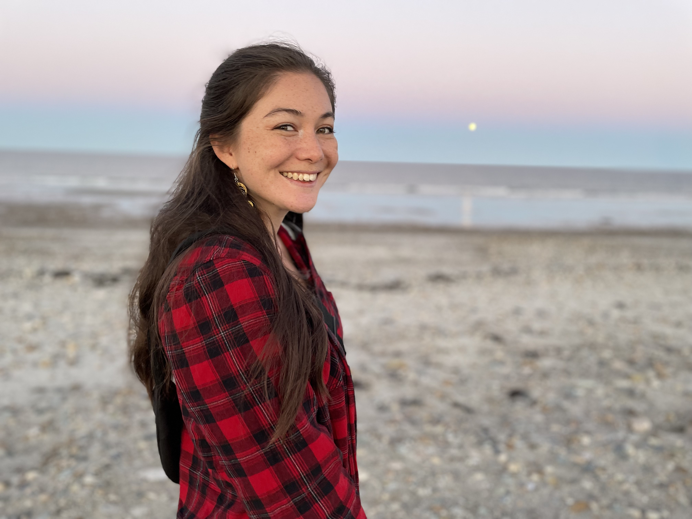

---
# Feel free to add content and custom Front Matter to this file.
# To modify the layout, see https://jekyllrb.com/docs/themes/#overriding-theme-defaults

layout: home
---

Hello world! My name is Ellen <3

I am PhD candidate in chemical oceanography in the MIT-WHOI Joint Program. My research uses [Biogeochemical Argo](https://biogeochemical-argo.org/) (BGC-Argo) floats to better understand carbon and oxygen cycling in the global ocean. I am interested in...

{: width="300" }
